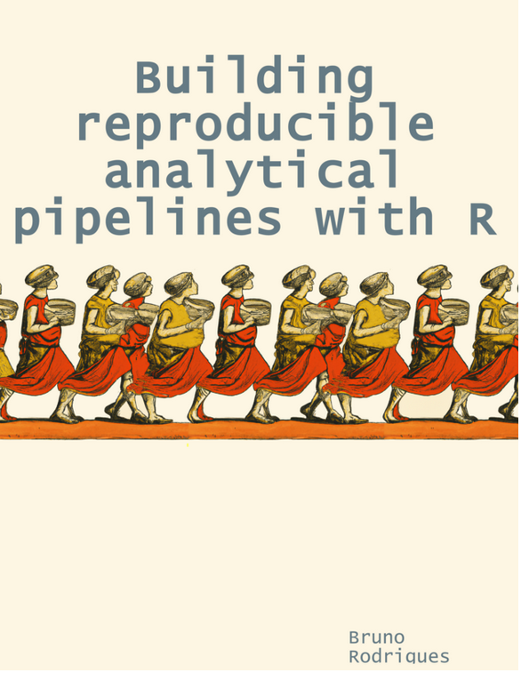
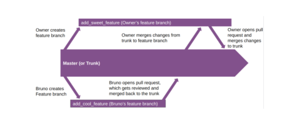

# Lessons from Bruno Book - Building   Reproducible Analytical Pipelines With R


## Housing data for Luxembourg

These scripts for the R programming language download nominalhousing prices from the _Observatoire de l'Habitat_ and tidy them up into a flat data frame.

Currently we have three scripts; ```data_cleaning.R``` that performs data cleaning, ```analysis_01.R``` that does some simple analyses and ```functional_programming.R``` that has sample codes for functional programming in R.

## Key lessons

This book is for anyone working with data who want to make their work as reproducible as possible. The main goal is to teach you how to use some of the best practices from **software engineering** and **DevOps** to make your projects robust, reliable and reproducible. It is divided into two main parts. The dominant philosophy for part one is **Don't Repeat Yourself** - DRY while the philosophy for part two is **Write It down**.

### PART 1 - DRY

For our work in data science to be truly reproducible we need to master three things; **version control** with Git, **Functional** Programming and **Literate** programming.

**Version Control with Git**



                       Key takeaways

We need to learn how to version our work using Git. Git is the software used for version control while GitHub is a hosting platform, we have other platforms like GitLab etc, but GitHub is the most common among developers/scientists. With practice anyone can learn Git, its not that much complicated and it offers immense benefits in the long run. You can install Git here: https://git-scm.com/downloads and sign up for a free GitHub account here: https://github.com/. This book will teach you all the basics you need to get started but we have other resources which might be more appealing for starters eg https://guides.github.com/activities/hello-world/.

Trunk based development was thoroughly emphasized in this section, where people work on separate branches to fix or update issues and then these changes are merged back to the main/master/trunk branch. Conflict resolution is also explained in detail.

Further reading: https://trunkbaseddevelopment.com/

**Functional Programming**

                      Key takeaways

The use of _pure functions_ is emphasized - these are functions that do not interact in any way with the global environment. Make sure that the functions do not rely on any globally declared variables as their inputs.

```bad <- function(x) { x + y}```

```good <- function(x, y) {x + y}```

Functions are first class objects meaning that we can do anything with them just like any other R object.
Functions that return functions are called function factories.

Write functions that do one thing and do it well. Write functions that work together. Write functions that handle lists, because that is a universal interface  _borrowed from the Unix philosophy_

List are one of the most important data structures you will work with in R. Many objects in R including models, data frames etc are actually lists. We should aim to write functions that can handle lists.

Use loops sparingly. Instead of loops we can use our own defined functions that abstract the loops, we can use base functions like ```Reduce()``` or use high-order functions implemented in ```purrr``` package. Loops are not highly optimized and can lead to the polluting of the global environment which might cause issues in your pipelines in the long run.

List-column based workflow is highly recommended. This is useful in helping us not to repeat ourselves. A good example is given in the book where we can plot several plots based on a list column in our nested data frame.

**Literate Programming**

      Key takeaways

In literate programming we mix code and prose, which makes the output not just a series of tables, or graphs or predictions, but a complete report that contains the results of the analysis directly embedded into it.

Literate programming has evolved over the years with tools like ```sweave```, ```knitr```, and recently we have ```quarto```. These tools allow you to mix code and prose when generating your report. Output formats can be pdf, word, blogs, books, or even websites.