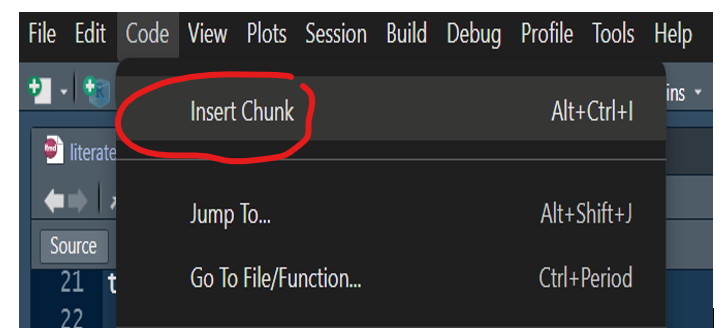

```{r setup, include=FALSE}
knitr::opts_chunk$set(echo = TRUE,
                      warning = F,
                      message = F)
```

## Introduction

Rmarkdown uses markdown language to help researchers or anyone really to mix their code and prose to form a unifying report. The report can be in multiple formats like word, html, pdf or even slides. For pdf reports you will need latex installed on your system. The easiest way of installing latex is via using the ```tinytex``` package by Yihui Xie the creater of ```knitr``` package.

Simple type the below code in the console

```{r, eval=FALSE}

# install.packages("tinytex")
# tinytex::install_tinytex()

#if you want to install a specific latex package that type the below code in the console

#tinytex::tlmgr_install("grfext") # to install grfext package
tinytex::tlmgr_install("tabularray.sty")

tinytex::reinstall_tinytex(repository = "illinois")

```


Titles, sections and subsections all start with a # and the depth level is determined by the number of #s. For bold text simply surround your text with double asterisks like this **some bold text** and the italics surround your text with single asterisks like this *this is some italicized text*. Underline text using pandoc (the program that converts Rmd files into final output) syntax as shown below;

[This is some underlined text in a R Markdown document]{.underline}

To use R code inside your document we use code chunks. This can be inserted using the keyboard shortcut Ctrl + Alt + I or using the menu bar




\newpage

Each chunk can have a label, thought the label is optional. The chunk also contains various optional settings that determine what you want to do with the chunk, for example do you want the code to be displayed in your report or only the output. To use this feature just specify echo = FALSE or echo = TRUE which is the default by the way.

The chunk below will not display the R code in the report, only the output will be displayed.

```{r, echo = FALSE}

a <- 1:20

a

```

There are several settings that you can explore on your own as an exercise.

To use inline code chunk write your code between two back ticks as in this example; `r nrow(mtcars)` .

To write a footnote use the following syntax;

This sentence has a footnote.^[This is the footnote]


## Tables in R markdown documents

```{r}
library(flextable)

my_table <- head(mtcars)

flextable(my_table) |> 
  set_caption(caption = "Head of mtcars dataset") |> 
  theme_booktabs()


library(modelsummary) # good for regression and summary tables

model_1 <- lm(mpg ~ hp + am, data = mtcars)
model_2 <- lm(mpg ~ hp, data = mtcars)
models <- list("Model 1" = model_1, "Model 2" = model_2)

modelsummary(models)

```


